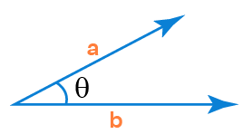
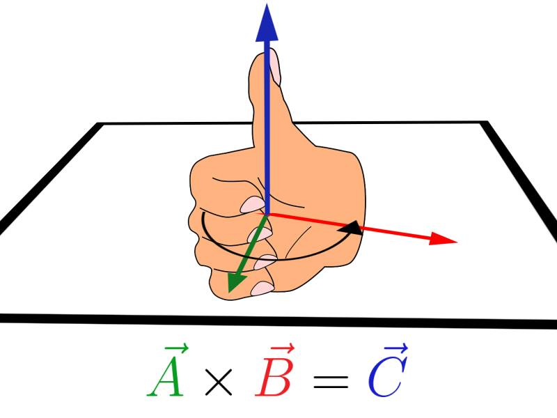
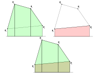

# Tangram

Um jogo simples de Tangram

## Implementação do ambiente

Utilizou-se three.js como _framework_ para desenhar mais facilmente
os polígonos no _browser_. Criou-se um plano paralelo ao plano do _browser_
em $z = 180$ como ambiente para desenho dos polígonos, e utilizou-se
uma câmera perspectiva, com um tronco de bases paralelas como campo de visão.
Os algoritmos foram todos implementados baseados no plano em $z = 180$. Para
isso, projetou-se somente a posição do cursor para coordenadas de dispositivo
normalizado da câmera, e então para o plano em $z = 180$.

## Algoritmo do ponto dentro do polígono
Para conseguir implementar a funcionalidade de arrastar cada uma das imagens,
era necessário identificar dentro de qual polígono o cursor do mouse estava
contido. Dessa forma, seria possível identificar qual o polígono que se desejava
movimentar.

### Ponto entre pontos
Tendo em mente esse fim do algoritmo do ponto dentro do polígono, primeiramente
se implementou um algoritmo que determinava se, dado um segmento delimitado por 2
pontos, um terceiro ponto colinear se encontrava entre estes dois pontos ou não, ou
seja, se ele se encontrava dentro do segmento. A figura a seguir ilustra os elementos
construídos para se determinar isso:

Através da geometria projetiva, pode-se determinar que:
$$r = p_1\times p_2,$$
onde $\times$ corresponde à operação de produto vetorial.

Denominando o ponto $p_4$ como sendo:
$$p_4 = (x_r, y_r, 0),$$
verifica-se que ele corresponde ao ponto no infinito de uma
reta arbitrária perpendicular à r. Pode-se assim determinar as
retas $s_1$ e $s_2$ como sendo:
$$s_i = p_i\times p_4$$
De posse destas retas, pode-se determinar facilmente que o ponto
se encontra dentro do segmento verificando se ele e $p_2$ estão
do mesmo lado da reta $s_1$ e se ele e $p_1$ estão do mesmo lado
da reta $s_2$:
$$(s_i\cdot p_{3 - i})(s_i\cdot p_3) \geq 0,$$
em que $\cdot$ corresponde à operação de produto escalar.

Vale notar que para esta equação funcionar, é necessário normalizar os pontos
quanto ao sinal do componente $w$.

### Interseção de dois segmentos
Agora que se pode determinar se um ponto está entre dois pontos em um segmento,
pode-se facilmente determinar se dois segmentos se intersectam:

O ponto $p_3$ pode ser achado diretamente por geometria projetiva:
$$p_3 = (p_1\cdot p_2)\cdot(p_4\cdot p_5)$$
De posse de $p_3$, basta verificar se ele está entre os pontos $p_1$
e $p_2$ e ao mesmo tempo entre os pontos $p_4$ e $p_5$ utilizando
o algoritmo proposto na seção anterior, para verificar se os
segmentos se intersectam.

### Ponto dentro do polígono
Agora que se tem um algoritmo para determinar se dois segmentos se intersectam,
pode-se determinar diretamente se um ponto $p$ está dentro de um polígono: denomina-se
o segmento $r$, que na verdade é uma semirreta, como sendo:
$$r = p\times p_\infty,$$
onde $p_\infty = (x_p, y_p, 0)$. Na prática, para funcionar, $p_\infty$ pode ser qualquer
ponto no infinito arbitrário. Escolheu-se $(x_p, y_p, 0)$ por simplicidade.

A seguir, computa-se para cada aresta do polígono se essa aresta e a semirreta $r$ se
intersectam. Determina-se desta forma quantas vezes o ponto bate no polígono quando é
estendido ao infinito, número que, se for ímpar, indica que o ponto está dentro do polígono.

## Rotação  

Primeiramente, calculamos o ângulo entre os vetores $\theta$ que sao construidos da seguinte maneira:
$\vec{v} = \vec{cursor} - \vec{centerMesh}$

Utilizando o arco cosseno, encontramos um ângulo entre 0 e 180 graus em radianos.  
Além disso, é analisado o sinal do produto vetorial entre o antigo vetor posição e o novo para saber se girou em sentido horario ou anti-horário. (A regra da mão direita)  

  

Vale ressaltar, que para que não exista problema para que o ângulo exceda 180 graus, o movimento do cursor é ¨*trackeado*¨, ou seja, a antiga e a nova posição são atualizadas a ¨todo instante¨.

É necessário, também, converter a posição do mouse para o referencial do Mesh, pois para o Mesh, a origem é o seu centro.

## Algoritmo da área de interseção dos polígonos

A detecção do término do jogo -- ou seja, da correta colocação das peças dentro do
quadrado do Tangran -- depende do cálculo da área de interseção entre o quadrado-solução
e cada uma das peças individuais. Assim, se o jogo identifica que as peças estão essencialmente
em cima do quadrado, sem auto-interseções relevantes, pode-se considerar o jogo como resolvido e
embaralhar as peças a fim de começar uma nova partida.

Para calcular a área de interseção dos polígonos, é necessário três etapas. Primeiro, é computado
(de forma genérica) o polígono de intersecção entre dois polígonos quaisquer. Após isso,
calcula-se a área do polígono-intersecção. Por fim, compara-se a intersecção com a área do
quadrado original.

### Interseção entre polígonos (clipping)

Como as figuras são convexas, foi implementado o algoritmo Sutherland-Hodgman para computar
a intersecção de dois polígonos convexos genéricos. Para isso, iteramos sobre as retas-suporte
das arestas de um dos polígonos no sentido anti-horário. Em cada passo, fazemos o corte do
outro polígono pela reta em questão, "cortando" tudo que estiver do lado de fora do polígono
original.

Para fazer cada corte, as arestas do polígono a ser cortado no sentido anti-horário. O polígono
resultante é inicialmente vazio. Se ambos os pontos da aresta estão sob o mesmo lado da reta,
ou esse é o lado de dentro do polígono (caso no qual a aresta é incluída no polígono resultante)
ou esse é o lado de fora do polígono (caso no qual a aresta não é incluída no polígono resultate).
Por outro lado, se os pontos estão em lados diferentes da reta de corte, então se calcula a
intersecção e adiciona o segmento cortado no polígono resultante.

### Cálculo da área de um polígono

No cálculo da área, o polígono é percorrido no sentido anti-horário pelas suas arestas. Para cada
ponto $P = (x_1, x_2, x_3)$ é feita a normalização 
$$P = (p_1, p_2, p_3) = \left(\frac{p_1}{p_3}, \frac{p_2}{p_3}, 1\right) = (x_p, y_p, 1),$$
em que $(x,y)$ é a coordenada do ponto em geometria analítica. A área do paralelogramo resultante
da projecão do segmento $\overline{PQ}$ sobre o eixo $x$ é dado por
$$A = \dfrac{(x_q - x_p) \cdot (y_q + y_p)}{2},$$
de modo que basta acumular essa área para cada aresta do polígono original. Visualmente, as áreas
verdes da figura abaixo contribuirão positivamente com a soma, enquanto as áreas vermelhas
contribuirão de forma negativa com a soma, resutando, ao final, a área do polígono original.

### Detecção de fim de jogo

Por fim, foi feita a detecção do fim do jogo ao comparar-se a área do quadrado-solução com as áreas
das intersecções dos polígonos do Tangran. Como também espera-se que a cobertura no jogo seja
disjunta, também foi calculadas as áreas das intersecções dois a dois dos polígonos pequenos
e subtraído da área de cobertura. Nas equações abaixo, $Q$ é o quadrado e $f, g$ são figuras
do Tangran.

$$A_{\text{cobertura}} = \sum_{f} A[Q \cap f] - \sum_{f \ne g} A[f \cap g]$$

$$\rho_{\text{cobertura}} = \dfrac{A_{\text{cobertura}}}{A[Q]}$$